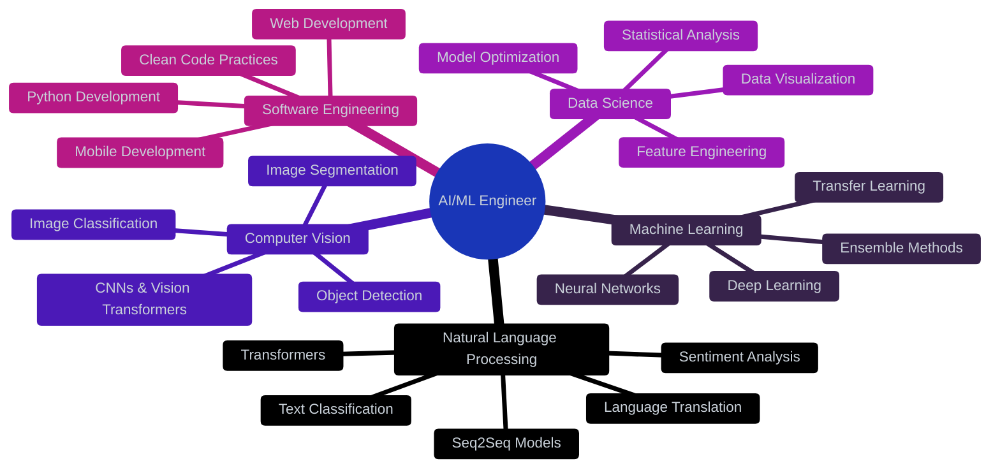

<div align="center">

<!-- Elegant Wave Header -->


<!-- Subtle Typing Animation -->
<p align="center">
  
</p>

<!-- Clean Status Badges -->
<p align="center">
  
  
  
</p>

</div>

<br/>

<!-- About Section with Glass Effect -->
<div align="center">

## 👨‍💻 About Me

</div>

<table align="center">
<tr>
<td width="50%" valign="top">

### 🎯 Current Focus

```typescript
const necromancer = {
  role: "AI/ML Engineer",
  location: "Digital Universe 🌍",
  
  working_on: [
    "Natural Language Processing",
    "Computer Vision Systems",
    "Deep Learning Architectures"
  ],
  
  learning: [
    "Advanced Transformers",
    "Neural Architecture Search",
    "MLOps & Production ML"
  ],
  
  interests: [
    "Research & Innovation",
    "Open Source Contributions",
    "AI Ethics & Responsible AI"
  ]
};
```

**📫 Reach me:** sayan20012002@gmail.com  
**💼 Open for:** Collaborations & Opportunities

</td>
<td width="50%" valign="top">

### 📊 GitHub Statistics

<p align="center">
  
</p>

<p align="center">
  
</p>

</td>
</tr>
</table>

<br/>

---

<br/>

<!-- Tech Stack -->
<div align="center">

## 🛠️ Technology Stack

### Core Languages

<p>
  
  
  
  
  
</p>

### AI/ML Ecosystem

<p>
  
  
  
  
  
  
</p>

### Data Science Tools

<p>
  
  
  
  
</p>

### Web Technologies

<p>
  
  
  
  
  
</p>

### Creative Suite

<p>
  
  
  
  
</p>

### DevOps & Tools

<p>
  
  
  
  
  
</p>

</div>

<br/>

---

<br/>

<!-- GitHub Analytics -->
<div align="center">

## 📈 GitHub Analytics

<p align="center">
  
  
</p>

<p align="center">
  
</p>

</div>

<br/>

---

<br/>

<!-- Featured Projects -->
<div align="center">

## 🚀 Featured Projects

</div>

<table align="center">
<tr>
<td width="50%">

### 🧠 BiLSTM Image Classification
Deep learning model using Bidirectional LSTM networks for advanced image classification tasks with enhanced temporal feature extraction.

[](https://github.com/Necromancer1009/BiLSTM-Image-Classification)

**Tech:** PyTorch • TensorFlow • Neural Networks

</td>
<td width="50%">

### 🌐 English-Bengali Translator
Neural machine translation model using GloVe embeddings and Seq2Seq architecture for accurate English to Bengali translation.

[](https://github.com/Necromancer1009/English-to-Bengali-Translator-Model-using-Glove-and-Seq2seq)

**Tech:** NLP • GloVe • Seq2Seq • Keras

</td>
</tr>
<tr>
<td width="50%">

### 🛡️ Spam Detection System
Machine learning pipeline for intelligent spam detection with high accuracy using ensemble methods and feature engineering.

[](https://github.com/Necromancer1009/Spam-Detection-Machine-Learning-approach)

**Tech:** Scikit-Learn • NLP • Classification

</td>
<td width="50%">

### 💬 Toxic Comment Classifier
CNN-based model with GloVe embeddings for multi-label toxic comment classification, promoting healthier online communities.

[](https://github.com/Necromancer1009/jigsaw-toxic-comment-classification-using-CNN-Glove-and-TF2)

**Tech:** CNN • GloVe • TensorFlow 2.0

</td>
</tr>
<tr>
<td width="50%">

### ✍️ Poetry Generator
Creative AI using deep learning to generate contextual poetry, exploring the intersection of art and artificial intelligence.

[](https://github.com/Necromancer1009/Poetry-Generator-using-Deep-Learning-Approach)

**Tech:** LSTM • NLP • Text Generation

</td>
<td width="50%">

### 🖼️ CIFAR Image Classification
Convolutional neural network implementation in PyTorch for CIFAR dataset classification with advanced augmentation techniques.

[](https://github.com/Necromancer1009/CIFAR-Classification-using-CNN-in-PyTorch)

**Tech:** PyTorch • CNN • Computer Vision

</td>
</tr>
</table>

<br/>

---

<br/>

<!-- Skills Visualization -->
<div align="center">

## 🎯 Expertise Areas



</div>

<br/>

---

<br/>

<!-- Contribution Graph -->
<div align="center">

## 🐍 Contribution Activity

<picture>
  <source media="(prefers-color-scheme: dark)" srcset="https://raw.githubusercontent.com/Necromancer1009/Necromancer1009/output/github-contribution-grid-snake-dark.svg">
  <source media="(prefers-color-scheme: light)" srcset="https://raw.githubusercontent.com/Necromancer1009/Necromancer1009/output/github-contribution-grid-snake.svg">
  
</picture>

</div>

<br/>

---

<br/>

<!-- Connect Section -->
<div align="center">

## 🌐 Let's Connect

<p>
<a href="mailto:sayan20012002@gmail.com">
  
</a>
<a href="https://github.com/Necromancer1009">
  
</a>
<a href="https://linkedin.com/in/necromancer1009">
  
</a>
<a href="https://twitter.com/necromancer1009">
  
</a>
</p>

<br/>

### 💭 Philosophy

> *"At the intersection of curiosity and code,*  
> *we craft the future of intelligent systems."*

<br/>

</div>

---

<br/>

<!-- Quote Section -->
<div align="center">


</div>

<br/>

---

<!-- Footer -->
<div align="center">


<br/>

<p>
  
  
</p>

<sub>⚡ Powered by passion • Driven by innovation • Inspired by possibilities ⚡</sub>

</div>