<div align="center">

<!-- Animated Header -->


[](https://git.io/typing-svg)


[](https://github.com/Necromancer0912?tab=followers)
[](https://github.com/Necromancer0912?tab=repositories)

</div>

---


## 🎯 **Who Am I?**

```python
#!/usr/bin/env python3
# -*- coding: utf-8 -*-

class Necromancer:
    """
    A student who codes by their own rules.
    Building the future, one neural network at a time.
    """
    
    def __init__(self):
        self.name = "Sayan"
        self.username = "Necromancer0912"
        self.role = "AI/ML Researcher & Full Stack Developer"
        self.location = "🇮🇳 India"
        self.education = "M.Tech CSE @ IIIT Delhi (1st Year)"
        self.mindset = "Think Different, Code Different"
        
    @property
    def current_status(self):
        return {
            "🔭 working_on": [
                "Advanced NLP Models",
                "Computer Vision Systems", 
                "Deep Learning Architectures",
                "Full Stack Web Applications"
            ],
            "🌱 learning": [
                "Transformer Architectures",
                "MLOps & Model Deployment",
                "Cloud Computing (AWS/GCP)",
                "Advanced React Patterns",
                "System Design"
            ],
            "🤝 open_to": [
                "AI/ML Research Collaborations",
                "Open Source Contributions",
                "Innovative Startup Ideas",
                "Freelance Projects"
            ],
            "💡 interests": [
                "Generative AI & LLMs",
                "Neural Architecture Search",
                "Computer Graphics",
                "Game Development",
                "UI/UX Design"
            ]
        }
    
    def get_daily_routine(self):
        return {
            "morning": "☕ Coffee + Research Papers",
            "afternoon": "💻 Coding & Building Projects",
            "evening": "🎮 Gaming or 🎨 Design Work",
            "night": "🌙 Deep Learning (literally)"
        }
    
    def life_philosophy(self):
        return """
        🎯 Don't follow the crowd, create your own path
        🚀 Innovation > Imitation
        💪 Fail fast, learn faster
        🧠 Knowledge is power, sharing is wisdom
        ⚡ Code with passion, ship with purpose
        """
    
    @staticmethod
    def contact():
        return {
            "email": "sayan20012002@gmail.com",
            "github": "github.com/Necromancer0912",
            "status": "Always open to interesting conversations!"
        }

# Initialize
me = Necromancer()
print(me.life_philosophy())
```

<br clear="right"/>

---

## 🛠️ **Tech Arsenal**

<details open>
<summary><b>🔥 Click to expand my tech stack</b></summary>
<br>

### **💻 Programming Languages**

<div align="center">


</div>

### **🤖 AI/ML & Data Science**

<div align="center">


</div>

### **🌐 Web Development**

<div align="center">

**Frontend**


**Backend**


</div>

### **📱 Mobile Development**

<div align="center">


</div>

### **🗄️ Databases**

<div align="center">


</div>

### **☁️ Cloud & DevOps**

<div align="center">


</div>

### **🛠️ Tools & IDEs**

<div align="center">


</div>

### **🎨 Design & Creative Tools**

<div align="center">


</div>

### **🐧 Operating Systems**

<div align="center">


</div>

### **📝 Documentation & Others**

<div align="center">


</div>

</details>

---

## 📊 **GitHub Analytics**

<div align="center">


</div>

### **📈 Contribution Graph**

<div align="center">

[](https://github.com/ashutosh00710/github-readme-activity-graph)

</div>

### **🏆 GitHub Trophies**

<div align="center">

[](https://github.com/ryo-ma/github-profile-trophy)

</div>

### **📊 Profile Summary**

<div align="center">


</div>

---

## 🌟 **Featured Projects**

<div align="center">

### **🧠 AI/ML Projects**

<table>
<tr>
<td width="50%">

<h3 align="center">BiLSTM Image Classification</h3>

<div align="center">  
<a href="https://github.com/Necromancer0912/BiLSTM-Image-Classification">

</a>

**Tech Stack:** `PyTorch` `BiLSTM` `Computer Vision`

Advanced image classification using Bidirectional LSTM networks. Explores sequential processing of image features for improved accuracy.

</div>

</td>
<td width="50%">

<h3 align="center">English-Bengali Translator</h3>

<div align="center">  
<a href="https://github.com/Necromancer0912/English-to-Bengali-Translator-Model-using-Glove-and-Seq2seq">

</a>

**Tech Stack:** `TensorFlow` `GloVe` `Seq2Seq` `NLP`

Neural machine translation model using GloVe embeddings and sequence-to-sequence architecture for English to Bengali translation.

</div>

</td>
</tr>

<tr>
<td width="50%">

<h3 align="center">Toxic Comment Classification</h3>

<div align="center">  
<a href="https://github.com/Necromancer0912/jigsaw-toxic-comment-classification-using-CNN-Glove-and-TF2">

</a>

**Tech Stack:** `TensorFlow 2` `CNN` `GloVe` `NLP`

Multi-label text classification for identifying toxic comments using CNN and GloVe embeddings. Kaggle competition solution.

</div>

</td>
<td width="50%">

<h3 align="center">AI Poetry Generator</h3>

<div align="center">  
<a href="https://github.com/Necromancer0912/Poetry-Generator-using-Deep-Learning-Approach">

</a>

**Tech Stack:** `LSTM` `RNN` `NLP` `Creative AI`

Creative AI that generates poetry using deep learning. Trained on classical poetry datasets to create original verses.

</div>

</td>
</tr>

<tr>
<td width="50%">

<h3 align="center">Spam Detection System</h3>

<div align="center">  
<a href="https://github.com/Necromancer0912/Spam-Detection-Machine-Learning-approach">

</a>

**Tech Stack:** `scikit-learn` `NLP` `Classification`

Machine learning approach to spam detection using various algorithms and NLP techniques for text classification.

</div>

</td>
<td width="50%">

<h3 align="center">CIFAR CNN Classifier</h3>

<div align="center">  
<a href="https://github.com/Necromancer0912/CIFAR-Classification-using-CNN-in-PyTorch">

</a>

**Tech Stack:** `PyTorch` `CNN` `Computer Vision`

Convolutional Neural Network implementation for CIFAR-10/100 image classification with data augmentation and optimization techniques.

</div>

</td>
</tr>
</table>

</div>

---

## 📚 **Research Publications**

<div align="center">

### **🎓 Published Research from IIIT Delhi**

*Advancing AI/ML applications in computational physics and biomedical engineering*

</div>

<details open>
<summary><b>📄 Click to view my research papers</b></summary>
<br>

### **Paper 1: Neuro-Computational Blood Flow Simulation**

<div align="center">

[](https://doi.org/10.1080/15368378.2025.2453923)
[](https://www.tandfonline.com/journals/iebm20)
[](https://doi.org/10.1080/15368378.2025.2453923)

</div>

**Title:** *Neuro-computational simulation of blood flow loaded with gold and maghemite nanoparticles inside an electromagnetic microchannel under rapid and unexpected change in pressure gradient*

**Authors:** Poly Karmakar, Sukanya Das, **Sayan Das**, Sanatan Das

**Published:** January 29, 2025 | *Electromagnetic Biology and Medicine*

#### 📋 **Abstract**

This research employs a **neuro-computational approach** combining artificial intelligence and computer simulations to predict blood flow patterns enhanced with **gold and maghemite nanoparticles** in an electromagnetic microchannel, particularly under sudden pressure gradient changes.

#### 🔬 **Key Contributions**

- 🧠 **AI/ML Implementation:**
  - Developed neural network models for predicting blood flow dynamics
  - Implemented machine learning algorithms for pattern recognition in nanoparticle behavior
  - Created computational simulations using deep learning frameworks (PyTorch/TensorFlow)
  - Trained models on electromagnetic field interactions with nanoparticles

- 🩸 **Biomedical Applications:**
  - Targeted drug delivery optimization
  - Enhanced medical imaging techniques
  - Precision treatment delivery in healthcare
  - Nanoparticle-based therapeutic systems

- ⚡ **Technical Innovations:**
  - Real-time prediction of flow patterns under pressure changes
  - Electromagnetic field modeling and simulation
  - Hybrid nanoparticle behavior analysis
  - Computational fluid dynamics (CFD) integration with AI

#### 🛠️ **Technical Stack**

```python
technologies = {
    "AI/ML": ["Neural Networks", "Deep Learning", "Pattern Recognition"],
    "Frameworks": ["PyTorch", "TensorFlow", "NumPy", "SciPy"],
    "Simulation": ["CFD", "Electromagnetic Modeling", "Finite Element Analysis"],
    "Data Analysis": ["Pandas", "Matplotlib", "Seaborn"],
    "Applications": ["Biomedical Engineering", "Nanoparticle Dynamics"]
}
```

#### 📊 **Research Workflow**


#### 🎯 **Impact**

- ✅ More precise drug delivery systems
- ✅ Improved medical imaging accuracy
- ✅ Enhanced understanding of nanoparticle behavior in biological systems
- ✅ Foundation for future AI-driven biomedical applications

---

### **Paper 2: AI-Led Dairy Industry Innovation**

<div align="center">

[](https://doi.org/10.1016/j.cjph.2024.11.025)
[](https://www.sciencedirect.com/journal/chinese-journal-of-physics)
[](https://doi.org/10.1016/j.cjph.2024.11.025)

</div>

**Title:** *AI-led study of dynamic changes in milk containing hybrid nanoparticles in an electromagnetically vibrated channel subjected to thermal oscillations and rapid pressure changes: Implications for dairy industry*

**Authors:** Research Team including **Sayan Das**

**Published:** November 2024 | *Chinese Journal of Physics*, Volume 93, Issue 9

#### 📋 **Abstract**

This groundbreaking study investigates the dynamic behavior of milk containing **silver-zinc oxide (Ag-ZnO) hybrid nanoparticles** when exposed to electromagnetic fields, utilizing an **AI-powered approach** for accurate evaluation and prediction of critical flow parameters with significant implications for the dairy industry.

#### 🔬 **Key Contributions**

- 🤖 **AI/ML Implementation:**
  - Developed AI models for predicting milk flow dynamics
  - Implemented neural networks for thermal oscillation analysis
  - Created machine learning algorithms for nanoparticle behavior prediction
  - Built predictive models for pressure gradient changes
  - Utilized Laplace transform approach with AI optimization

- 🥛 **Dairy Industry Applications:**
  - Dairy decontamination processes
  - Quality control optimization
  - Thermal processing improvements
  - Nanoparticle-enhanced preservation techniques

- ⚙️ **Technical Innovations:**
  - Electromagnetic field interaction modeling
  - Hybrid nanoparticle dynamics simulation
  - Thermal oscillation prediction
  - Real-time flow parameter evaluation
  - Riga plate electromagnetic configuration

#### 🛠️ **Technical Stack**

```python
research_tools = {
    "AI/ML": [
        "Neural Networks",
        "Predictive Modeling",
        "Time Series Analysis",
        "Deep Learning"
    ],
    "Frameworks": [
        "PyTorch",
        "TensorFlow",
        "scikit-learn",
        "NumPy/SciPy"
    ],
    "Mathematical Methods": [
        "Laplace Transform",
        "Partial Differential Equations",
        "Numerical Analysis",
        "Computational Fluid Dynamics"
    ],
    "Simulation": [
        "Electromagnetic Field Modeling",
        "Thermal Analysis",
        "Nanoparticle Dynamics",
        "Porous Medium Flow"
    ],
    "Applications": [
        "Dairy Industry",
        "Food Processing",
        "Quality Control"
    ]
}
```

#### 📊 **Research Workflow**


#### 🔍 **Key Findings**

- 📈 **Velocity Analysis:**
  - Milk velocity increases with higher modified Hartmann number
  - Velocity decreases with wider electrodes
  - Optimal flow parameters identified for industrial applications

- 🌡️ **Thermal Characteristics:**
  - Hybrid nano-blood (HNB) transfers more heat than nano-blood (NB)
  - Gold and maghemite nanoparticles show enhanced thermal properties
  - Temperature oscillation patterns successfully predicted by AI

- ⚡ **Electromagnetic Effects:**
  - Riga plate configuration optimization
  - Electromagnetic field strength impact on flow dynamics
  - Shear stress and heat transfer rate analysis

#### 🎯 **Impact**

- ✅ Revolutionary dairy decontamination methods
- ✅ Enhanced food safety protocols
- ✅ Optimized thermal processing in dairy industry
- ✅ AI-driven quality control systems
- ✅ Foundation for nanoparticle applications in food processing

---

### **🔬 Research Methodology Overview**

<div align="center">


</div>

### **💡 Research Impact Summary**

| Aspect | Paper 1 (Blood Flow) | Paper 2 (Dairy Industry) |
|--------|---------------------|-------------------------|
| **Domain** | Biomedical Engineering | Food Science & Engineering |
| **AI/ML Role** | Flow prediction, Pattern recognition | Parameter prediction, Optimization |
| **Nanoparticles** | Gold, Maghemite | Silver-Zinc Oxide |
| **Applications** | Drug delivery, Medical imaging | Decontamination, Quality control |
| **Innovation** | Neuro-computational simulation | AI-led dynamic analysis |
| **Impact** | Healthcare precision | Dairy industry safety |

### **🎓 Research Skills Demonstrated**

- ✅ **AI/ML Expertise:** Neural networks, deep learning, predictive modeling
- ✅ **Mathematical Modeling:** PDEs, Laplace transforms, numerical analysis
- ✅ **Computational Physics:** CFD, electromagnetic simulations, thermal analysis
- ✅ **Interdisciplinary Research:** Biomedical + Food science applications
- ✅ **Programming:** Python, PyTorch, TensorFlow, scientific computing
- ✅ **Problem Solving:** Real-world applications in healthcare and industry

</details>

---

## 💼 **Experience & Achievements**

```mermaid
graph LR
    A[🎯 Started CS] --> B[📚 Core Programming]
    B --> C[🤖 Discovered AI/ML]
    C --> D[🧠 Deep Learning]
    D --> E[🚀 Advanced Projects]
    E --> F[💡 Research & Innovation]
    
    style A fill:#00d9ff,stroke:#fff,stroke-width:2px,color:#000
    style B fill:#00d9ff,stroke:#fff,stroke-width:2px,color:#000
    style C fill:#00d9ff,stroke:#fff,stroke-width:2px,color:#000
    style D fill:#00d9ff,stroke:#fff,stroke-width:2px,color:#000
    style E fill:#00d9ff,stroke:#fff,stroke-width:2px,color:#000
    style F fill:#00d9ff,stroke:#fff,stroke-width:2px,color:#000
```

<details>
<summary><b>🎓 Academic Journey</b></summary>
<br>



**🏆 Key Achievements:**
- 📚 **Published 2 research papers** in international journals (2024-2025)
  - *Electromagnetic Biology and Medicine* (2025)
  - *Chinese Journal of Physics* (2024)
- 🎓 **M.Tech CSE at IIIT Delhi** - Specializing in AI/ML Research
- 🧠 **AI/ML Research:** Neuro-computational simulations, predictive modeling
- 🥇 Built 15+ AI/ML projects from scratch
- 📝 Implemented state-of-the-art research papers in production
- 🎯 Contributed to open-source ML libraries
- 💻 Developed full-stack applications with AI integration
- 🌟 Mentored juniors in programming & AI
- 🔬 Interdisciplinary research in biomedical engineering & food science

</details>

<details>
<summary><b>🎯 Skills Matrix</b></summary>
<br>

| Skill Category | Technologies | Proficiency |
|----------------|--------------|-------------|
| **AI/ML** | PyTorch, TensorFlow, scikit-learn | ⭐⭐⭐⭐⭐ |
| **Deep Learning** | CNN, RNN, LSTM, Transformers | ⭐⭐⭐⭐⭐ |
| **NLP** | BERT, GPT, Word2Vec, GloVe | ⭐⭐⭐⭐ |
| **Computer Vision** | OpenCV, Image Processing, Object Detection | ⭐⭐⭐⭐ |
| **Web Development** | React, Next.js, Node.js, Express | ⭐⭐⭐⭐⭐ |
| **Mobile Dev** | Android, Kotlin, React Native | ⭐⭐⭐⭐ |
| **Backend** | Python, Node.js, FastAPI, Django | ⭐⭐⭐⭐⭐ |
| **Databases** | MySQL, PostgreSQL, MongoDB | ⭐⭐⭐⭐ |
| **DevOps** | Docker, Git, CI/CD | ⭐⭐⭐ |
| **Design** | Figma, Photoshop, Blender | ⭐⭐⭐⭐ |

</details>

<details>
<summary><b>📚 Learning Journey</b></summary>
<br>

### **Current Focus Areas**

```python
learning_roadmap = {
    "2024_Q4": {
        "completed": [
            "✅ Advanced Transformer Architectures",
            "✅ MLOps Fundamentals",
            "✅ System Design Basics"
        ],
        "in_progress": [
            "🔄 Large Language Models (LLMs)",
            "🔄 Kubernetes & Container Orchestration",
            "🔄 Advanced React Patterns"
        ],
        "upcoming": [
            "📅 Reinforcement Learning",
            "📅 GraphQL & Modern APIs",
            "📅 Cloud Architecture (AWS/GCP)"
        ]
    }
}
```

### **Books I'm Reading**

- 📖 *Deep Learning* by Ian Goodfellow
- 📖 *Designing Data-Intensive Applications* by Martin Kleppmann
- 📖 *The Pragmatic Programmer* by Andrew Hunt
- 📖 *Clean Code* by Robert C. Martin

### **Courses & Certifications**

- 🎓 Deep Learning Specialization (Coursera)
- 🎓 Machine Learning (Stanford Online)
- 🎓 Full Stack Web Development
- 🎓 Advanced Algorithms & Data Structures

</details>

---

## 🎨 **Creative Side**

<details>
<summary><b>🎮 When I'm Not Coding...</b></summary>
<br>

### **🎵 Music That Fuels My Code**

```javascript
const codingPlaylist = {
    genres: ["Synthwave", "Lo-fi Hip Hop", "Electronic", "Ambient", "Rock"],
    favoriteArtists: [
        "The Midnight",
        "Gunship", 
        "Chillhop Music",
        "HOME",
        "Kavinsky"
    ],
    currentlyPlaying: "🎧 Synthwave mix for deep focus coding sessions",
    motto: "Good code needs good music 🎵"
};
```

### **🎮 Gaming & Interests**

- 🎮 **Gaming:** Strategy games, RPGs, Indie games
- 🎨 **3D Modeling:** Creating assets in Blender
- 🎬 **Video Editing:** Motion graphics & VFX
- 📸 **Photography:** Street & landscape photography
- ✍️ **Writing:** Tech blogs & documentation

### **💭 Philosophy & Mindset**

> *"I don't follow trends, I set them. I don't copy code, I architect solutions. I don't just build apps, I create experiences."*

**My Principles:**
- 🧠 **Think Different:** Question everything, innovate constantly
- 🚀 **Move Fast:** Prototype quickly, iterate rapidly
- 💪 **Stay Hungry:** Never stop learning, always stay curious
- 🤝 **Give Back:** Share knowledge, help others grow
- ⚡ **Own It:** Take responsibility, deliver excellence

</details>

---

## 📈 **Coding Activity**

<details>
<summary><b>⏰ Development Time Breakdown</b></summary>
<br>

<!--START_SECTION:waka-->
```text
Python       12 hrs 30 mins  ████████████░░░░░░░░░   48.2%
JavaScript   6 hrs 15 mins   ██████░░░░░░░░░░░░░░░   24.1%
TypeScript   3 hrs 45 mins   ███░░░░░░░░░░░░░░░░░░   14.5%
C++          2 hrs 10 mins   ██░░░░░░░░░░░░░░░░░░░    8.4%
Other        1 hr 15 mins    █░░░░░░░░░░░░░░░░░░░░    4.8%
```
<!--END_SECTION:waka-->

### **📊 Weekly Development Breakdown**

```text
🌞 Morning    ████████░░░░░░░░░░░░   35% 
🌆 Daytime    ████████████░░░░░░░░   45%
🌃 Evening    ██████░░░░░░░░░░░░░░   15%
🌙 Night      ██░░░░░░░░░░░░░░░░░░    5%
```

### **💻 Development Environment**

```yaml
OS: Linux (Ubuntu/Mint) 🐧
Editor: VS Code with custom theme 🎨
Terminal: Zsh with Oh My Zsh ⚡
Font: JetBrains Mono Nerd Font 🔤
Theme: Custom Dark Theme with cyan accents 🌃
```

</details>

---

## 🌐 **Connect & Collaborate**

<div align="center">

### **📫 Let's Build Something Amazing Together!**

[](mailto:sayan20012002@gmail.com)
[](https://github.com/Necromancer0912)
[](https://linkedin.com/in/necromancer0912)
[](https://twitter.com/necromancer0912)
[](https://necromancer0912.github.io)

### **💬 Open For:**

🤝 **Collaborations** • 💼 **Freelance Projects** • 🔬 **Research Opportunities** • 🎓 **Mentorship** • 💡 **Innovative Ideas**

</div>

---

## 🎯 **2024 Goals**

<div align="center">


</div>

### **📊 Progress Tracker**

- [x] ✅ Complete 10 AI/ML projects
- [x] ✅ Master PyTorch & TensorFlow
- [x] ✅ Build full-stack applications
- [ ] 🔄 Contribute to 5 major open-source projects (3/5)
- [ ] 🔄 Write 20 technical blog posts (8/20)
- [ ] 📅 Launch personal SaaS product
- [ ] 📅 Speak at tech conference
- [ ] 📅 Reach 1000 GitHub stars across repos

---

## 💡 **Random Dev Quotes**

<div align="center">


</div>

---

## 🐍 **Contribution Snake**

<div align="center">


</div>

---

## 📊 **Metrics**

<div align="center">


</div>

---

## 🎨 **GitHub Skyline**

<div align="center">

<a href="https://skyline.github.com/Necromancer0912/2024">
  
</a>

</div>

---

## 💭 **Visitor's Thoughts**

<div align="center">

<!-- Guestbook -->
**Leave a star ⭐ if you find my work interesting!**

**Drop a follow if you want to see more cool projects! 🚀**

</div>

---

<div align="center">

### 🌟 **"Code is poetry, and I'm writing an epic."** 🌟


**Made with 💙 and ☕ by Necromancer0912**

*Last Updated: 2024 • Built with passion, shipped with purpose*

</div>

---

<div align="center">

### 📈 **Profile Stats Counter**


</div>
